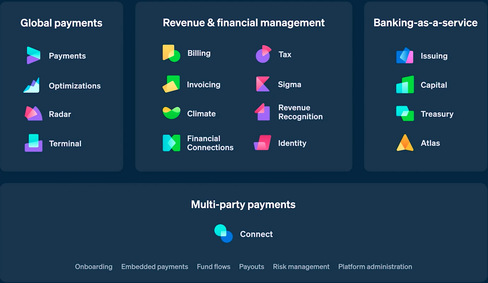

# Increase GDP of internet

Two young brother form Ireland have democratised online payments – and reshaped the digital economy in the process.

## Overview and Origin

In year 2005 on a cold winter night in Varanasi (India), near the banks of holy river Ganga Ali proud owner of a small handloom company was holding beautiflly designed fabric made by his workers that involved intrique work of 90 hrs. The more he look at the  fabric he feels that how could he pay well to his workers. He could barely manage to pay the minimum wages selling in local market. It was time to expand and sell in bigger markets, but he could do so sitting in Varanasi. As he had low income and lack of assets the traditional bank would not give him loan to setup something in another town . It is a challenge for him to introduce himself to big Retailers or wholesaler in his domain.

"According to the World Bank’s Small and Medium Enterprise Department, there are between 365 and 445 million micro, small and medium-sized enterprises in emerging markets, contributing up to 60% of employment and up to 40% of national GDP. The main problem these companies face is access to finance. So how can entrepreneurs from emerging nations join the global market and help lift the wealth of their nations? One of the solutions comes from a small village in Ireland called Dromineer, of population 102 and the birthplace of the world’s youngest self-made billionaires, Patrick and John Collision."

Dromineer is a beautiful Irish village - It’s also where Patrick and John Collison, learned to code – and where they began to think about online payments. It’s where they began laying the foundations for **Stripe**. Patrick and John found school boring. They always found the technical chats aournd the family table interesting which clearly outstripped anything they learned in school. Their father,trained as an electronic engineer and mother, as a microbiologist, laid the foundation that made them fascinated by maths and physics. 

In their teens they launched their first startups **Auctomatic** – a software-as-a-service platform for eBay power sellers to track inventory and traffic – and an iPhone app providing an offline copy of Wikipedia, pitched by the brothers as **Hitchhikers Guide to the Galaxy** on the iPhone.

In 1998 Elon Musk, Peter Thiel and Max Levchin launched **PayPal** which was bought by eBay in 2002 for $1.5 billion. PayPal supposed to have solved online payment,but layers of intermediation still existed. Also, once the turnover of a company reaches a certain level PayPal would automatically put the business on 21-60 days of rolling reserve, which means a company would not have access to around 30% of its revenue for upto 2 months.

In 2008, Patrick and John sold their first startup Auctomatic to Canada’s Live Current Media for $5 million, post which they went back to university, MIT and Harvard respectively. Where they came up with 7 lines of code that anyone could insert in their website or app in a day to connect to a payment compay. A complex process that would take weeks was now reduced to simple copy and paste.

In 2010, the brothers dropped out of college and launched a service /dev/payments with a promise that the 7 lines of code is all that developers for online payment integration.

In 2011, they pitched Peter Thiel and Elon Musk, the founders of PayPal - the idea of removing layers of intermeditaion and provide fast and secure online Payment solution that could be integrated with any website or app with just 7 lines of code. This resulted into seed investment of $2 million. Finally in **September 2011 they launched Stripe**

"Just five months after launching, Stripe already raised another round of funding – an $18 million Series A that valued the company at $100 million. The round was led by Sequoia Capital with participation from Affirm and PayPal co-founder Max Levchin. Later that year, Stripe expanded to Canada, its first foreign country."

By 2013 Stripe was successful enough for expansion. In March 2013 bought Kickoff which is a chat and task management platform. Futhermore they exppanded Stripe expanded it's product lineup. Stripe became so big by 2016 that other Fintech companies like PayPal and Square launched payment processing products. A year later in 2017 Stripe bought the business community named Indie Hackers. The same year Stripe sign up some Huge clients including Amazon, Facebook, or Uber

"By 2018, Stripe started to invest heavily in other startups, either in the FinTech space or other industries. The thinking behind those investments was (and still is) that Stripe’s clients generate an abundance of data. This allows Stripe to assess how those companies are performing financially, especially in relation to competition that might be part of the platform."

In 2020 when the world was finding ways to keep the businesses up and running in a pandemic, Stripe sales skyroceted as more and more businesses went online. The ease of intergation and fast movement of money across globe made Stripe popular between small, mid and Big businesses. As a result Stripe was able to rasie its valuation to $95 billion from $20 billion in 2019. Today Stripe work together with more than million businesses worldwide.

Once that was launched as a online payment processing company has now a range of products that supports small and big businesses across domains. As they say "Stripe builds financial tools and economic infrastructure for the internet. We’re helping small startups and the world’s biggest companies build products, create business models and scale their efforts globally."
<a>Image via Stripe Session 2022</a>

## Business Activities

**Stripe** provides unified platform to businesses for all their payments needs. They have a fully integrated suite of payments and financial products that allow website and apps to accept payments and send payout worldwide.They help companies beat wire frauds, issue physical and virtual cards, issue invoices, get financing, manage business spend at lightining speed. Their products are not limited to online business, they also have products to suit the need of in person retailers.

### Payment Platform
#### <mark style= "background-color:DodgerBlue;color:white">Accept -> Process -> Settle and reconcile -> Manage </mark> 
Stripe help businesses to accept payments and move money globally with Stripe's powerful API's and software solutions that are designed to caputre more revenue. From e-commerce stores to subscription businesses, to platforms and marketplaces, Stripe offer a complete stack for all payments needs across channels.

### Accept payments
------

>**Customer interfaces** One can create a perfect checkout experience that works for all browsers and devices of all sizes. Stripe provides a range of options to choose from.  
>- *Hosted payment page* is a prebuilt checkout page that can be customized as per the brand requirement. Based on customer's location checkout dynamically adapts language and payment methods, and comes with mobile wallets, coupons and tax rate support. Easy checkout process enables better customer experience and helps companies increase their revenue.
>- *Embeddable UI toolkit* also referred as Stripe Elements , helps design a custom payment page. All UI elements are built by experienced front-end, design and analytics teams to help minimise user error.
>- *API only* integration allows to build a fully API-based functionality or one can only use Stripe's javascript library to tokenise customer payment details – all while designing custom checkout page.
>- *In person payments* can be be accepted using Stripe Terminal. Stripe Terminal enables businesses to build their own in-person checkout to accept payments in the physical world. Terminal helps businesses unify their online and offline channels with flexible developer tools, pre-certified card readers, and cloud-based hardware management.
>- *Payment Links* enables users to sell a product or service, start a subscription, or accept a donation. One can create a payment page in few clicks without any coding.
>- *Invoicing* was never better before. Stripe invoicing is a global platform that helps generate invoices and get paid faster. One can create and send Stripe hosted invoice in minutes without any coding or,use the Invoicing API and advanced features to automate payments collection and reconcile them.
>- *Third-party integrations* using prebuilt e-commerce plug-ins to efficiently integrate payments into user store with a simple and easy setup.

>**Payment options** With the advent of high speed internet and technological advancement in banking, it has become easy for businesses to go Global. Stripe's study shows that 70% of the businesses are selling internationally. Global customer conversion becomes easy when you give customers local payments options. With Stripe Checkout and Payment Element one can add payment methods right from the Stripe Dashboard without any additional integration work and rely on Stripe to dynamically display the right payment methods and language based on IP, browser locale, cookies, and other signals. Checkout is also able to trigger 3D Secure and can handle European SCA requirements by dynamically applying card authentication when required by the cardholder’s bank.
>- *Cards* one can accept all major debit and credit cards from customers across the globe.
>- *Digital wallets* Enable customers to check outfaster with wallet payment methods that digitally store credit and debit cards. Wallets eliminate the need for customers to manually enter their card and billing information, offering a quick and convenient way to pay.
>- *Bank debits and transfers* minimise involuntary churn by accepting direct debits for subscription or recurring charges. For large transactions, Stripe makes it possible to accept credit transfers or wires with automated reconciliation, lowering the chance of payment failure without adding operational complexity.
>- *Buy now, pay later* Offer flexible payment options that increase customer's purchasing power, leading to higher conversion and order value.
>- *Cash-based vouchers* allow customers to pay bills and online purchases in-store with cash.
>- *Currencies* Stripe's suite allows businesses to charge customer's in customer local curriencies and receive fund in theirs. If the charge currency differs from your settlement currency, Stripe converts the charge to your settlement currency.
>- *Subsidiary support* one can setup local Stripe accounts to take advantage of  local optimised acquiring that gets maximised acceptance rates, the lowest costs, and no FX/cross-border fees for customers. 

>**Mobile**  Stripe's mobile SDK helps businesses accept payments from IOS app, Android app or website with fewlines of code and no change in backend is required.
>- *iOS & Android SDK* Stripe's native iOS and Android libraries are stable and can be used collect card information without sensitive PCI data ever hitting servers. 

### Process Payments
-----
>**Use cases** Stripe provides complete technology stack to support any business model.
>- *Online payments* Start accepting payment in minutes. Stripes flexible API, libraries and SDK help design a secure and customised payment flow. Stripe docs provide [step by step guide to accept a payment](https://stripe.com/docs/payments/accept-a-payment).
>- *Omni-channel* Break down barriers between online and offline data. Stripe Terminal helps unify online and offline channels with flexible developer tools, pre-certified card readers, and cloud-based hardware management.
>- *Recurring payments* Stripe provide composable API using which business can provide flat-rate plans, tier and usage-based subscriptions. With built-in solutions to automatically update expired cards, retry failed payments and let customers manage their payment information, Stripe makes it easy for businesses to set up and manage recurring payments.
>- *Platform and marketplace payments* can be easily integerated with any mobile app or website by using Stripe programmable APIs and tools. Stripe Connect is the fastest, secure and reliable way to achieve that.

>**Revenue optimisation** can be achieved by fixing the inefficiencies of legacy payments system, that have a complex routing path which leads to delays and number of decline transactions. Stripe's intent APIs and pre-processing layer have made it easy and efficient to make settlements.
>- *Authentication* - Stripe Payment Intents APIs apply strong and smart authentication logic that emables high conversion rate while minimising the disruption to user experience. Learn how to [integrate Payment Intents API](https://stripe.com/docs/payments/payment-intents) for enhanced customer experience.
>- *Authorisation* - Stripe’s entire platform is designed to minimise declines and maximise revenue, from tools that update stored card details and identify the best time to retry failed recurring payments, to machine learning models that can recapture declines in real-time.

>**Fraud & disputes** Stripe's Machine learning  based fraud prevention systems that comes fully integrated with Payments APIs helps businesses manage fraud with confidence. Stripe has access to millions of legitimate data, as per them if customers card is new than also there is 89% of chance that it's been seen before at Stripe.
>- *Stripe Radar* detects and blocks fraud using Machine learning. By learning from millions of global businesses processing billions in payments each year, Radar can assign risk scores to every payment and automatically block many high-risk payments.
>- *Dynamic 3D Secure* reduces risk of fraud by adding additional layer of authentication. Learn more on how to add [3D Secure authentication](https://stripe.com/docs/payments/3d-secure#three-ds-radar) .
>- *Dispute handling* - Stripe provides end to end Programmatic dispute management, which eliminates the manual work that goes into handling disputes. Stripe have made fraud and dispute handling easy. Learn more about [Fraud and disputes](https://stripe.com/docs/disputes) at Stripe docs.

### Settle and reconcile
----
>**Reconciliation** Stripe's unified financial reporting system accelerates data reconciliation and recoginse transactions.
>- *Financial reporting* system provides a set of financial reports to help reconcile transactions. **Stripe Sigma** allows users to build custom reports by exploring Stripe data using SQL. **Stripe Connector** provides intergation with existing workflows. It enables user to Sync Stripe data in real time with NetSuite or choose integration with other accounting & ERP systems like Xero, Zoho Books, Quickbooks and more. Stripe [Reporting APIs](https://stripe.com/docs/reports/api) help to import data to user systems.
>- *Consolidated reports* - Stripe built-in reporting feature enables it's user to access range of standard financial reports that helps reconcile data faster, it also provides APIs to generating custom reports.
>- *Revenue Recognition* is built into Stripe, it streamlines accounting so that companies can close books acurately and fast.
>- *Accounting support*  helps automatically sync Stripe Data with accounting ledger of the companies

>**Payouts** made faster and easy with Stripe. Once a transaction is settled, funds are automatically transfered to users account. This functionality can be built  either by using Stripe APIs or dashboard. Stripe technology stack enables unified payouts across all different payment methods and 135+ curriencies 

### Manage
-----
>**Reporting & insights**
>- *Stripe Sigma* enables users to use SQL to analyse Stripe data, and create custom reports right inside the dashboard. It allows users to save and share queries. Stripe Sigma provides built in query templates for transaction decline analysis, ARPU, churn and more.
>- *Stripe Dashboard* is a single stop to manage all your Stripe Data, plans, balances, customers. 
>- *Dashboard mobile app* helps Track and manage our payments on the go by providing reports of daily earnings, new customers and payments.

>**Business operations** Business owners can have share access to their Stripe account with other team members . Each user gets an individual account with fine-grained access control and visibility.
>- *Roles & permissions* Tailor data access for team members to ensure that business-sensitive information and actions are protected. Business owners can keep track of recent activity on their Stripe account from all of team members – from bank account changes to logins or data exports.
>- *Account security* Stripe provides secure access to Stripe accounts. It support SMS 2 step authentication, Google Authenticator two-step authentication and U2F key.
>- *Collaboration notes* Users can attach notes to their teammates on payments and refunds to give them context once they log into the dashboard
>- *Sales tax, VAT, and GST automation* Stripe  automatically calculate and collect the correct amount of sales tax, VAT, and GST, and access the reports businesses need to file returns with **Stripe Tax**.

>**Third party integrations & support**
>- *Pre-built integrations* One can extend their Stripe account with tools to help grow business. Create a store in minutes with Shopify, invoice clients with Freshbooks, or collect payments in a Typeform. More tools and products that work with Stripe are added regularly.
>- *24×7 email, chat and phone support* Stripe provides an excellent customer supports.

## Results and Analysis

Stripe is renowned for its speedy and secure payment processing. In addition, because of its ease of integration and convenience of use, many business owners and developers find it easy to work with Stripe's platform.

### Stripe Pros

- *Pricing*: On the whole, Stripe has a simple, transparent pricing structure and only charges transaction fees. Stripe does not charge other typical fees that some merchant service providers charge, which makes its pricing model simple. Stripe users only have to worry about a single, flat-rate, per-transaction charge if they are accepting online payments. Plus, this rate is competitive with other processors on the market and Stripe includes all of their pricing information on their website.

- *Functionality*: As a payments solution, Stripe is extremely functional, allowing users to accept all types of payments in the way that works best for the business. With an emphasis on online payments, Stripe gives it's users the ability to accept payments through an embeddable checkout, custom payment form, and even through invoices. Plus, despite their online payment focus, businesses can also accept in-person payments with Stripe. Another highlight is that business owners can sign up for an account quickly and easily online and get started taking payments instantly. Stripe also includes a standard level of security, can accommodate international commerce, and integrates with hundreds of other platforms.

- *Customization*: Stripe is often referred to as a “developer’s payments solution,” due to their custom UI toolkit and available APIs. With these tools, users can completely customize payments solution. For non developers Stripe offers an impressive level of built in tools that helps customization for all business owners.

### Stripe Cons

- *Account stability*: Stripe is a payment service provider (PSP), meaning they aggregate all of their customers’ payments into a single merchant account and distribute the funds from there. Among other benefits, one of the most notable advantages of a PSP is that you can sign up for an account quickly and easily, without the underwriting process required to get a dedicated merchant account for your business. This being said, however, this type of system also means that your Stripe account is subject to greater stability issues—if Stripe deems your business too risky, they can cancel or freeze your account with little notice.

- *Cost*: Although Stripe’s pricing can be an advantage, it can also be a drawback. Even though the pricing is easy to understand and there are very few Stripe fees, Stripe may not always be the most affordable solution. Some users also report that Stripe can be expensive, particularly if you decide to utilize their paid add-on tools.

- *Developer-focused*: The developer-focus of Stripe is extremely useful if you’re a developer or have access to developer resources, but if you don’t, you may not be able to take advantage of everything Stripe has to offer. Although any business can use Stripe, there may be options that are more user-friendly and can work better for those without developer experience or access to those resources.

- *In-person payments*: Although Stripe does offer a solution for accepting in-person payments, the platform really isn’t designed for that purpose. Business owners looking to first and foremost accept in-person payments will benefit more from a point of sale-focused solution with capabilities more suited to meet their needs.

### Stripe Competitors
 Considering the breadth of the merchant services industry, there are a variety of alternatives out there—from full-service merchant account providers to simple payment gateway providers. 

- **Square** Like Stripe, Square has quickly become one of the most recognizable names in the payment processing space. First and foremost, Square is a POS provider with free POS software and a variety of hardware options. However, Square has a vast product suite that extends beyond POS and into ecommerce, online payments, invoicing, and more. Here are some of the biggest benefits of Square when compared to Stripe:
    - *Point of sale*: If accepting in-person payments is a priority for a business than, Square will be a better solution than Stripe. Square offers free POS software and multiple hardware options—plus, their in-person transaction fees are lower at 2.6% + $0.10 per transaction. Although Stripe can integrate with POS solutions, Square can provide actual payment processing, as well as POS system options that can accommodate a variety of small businesses. Overall, between their robust free POS software, additional product options, and ease of use, Square is a top POS provider and can offer much more for in-person payments than Stripe.

    - *Online store*: Square offers a full online store service, with the first subscription plan available at $0 per month—you only pay transaction fees.

    Overall, Square a top alternative to Stripe if one is looking for a solution that extends beyond online payments. Although Square’s online payments platform may not be as sophisticated as Stripe’s, Square offers a user-friendly solution for building an ecommerce store, as well as accepting both online and in-person payments. With their POS system, Square will certainly be a better option for brick-and-mortar retailers and can be particularly useful for those retailers looking to branch into online sales.

- **Paypal** is very likely one of the first brand names that comes to mind when we talk about online payments. PayPal has years of experience with online payments and continues to be a go-to solution for individuals and businesses alike. All in all, PayPal allows business owners to accept online payments in different ways—they offer a simple payment gateway service that gives business owners the ability to create a hosted checkout page, they provide a full-service solution to customize payments form, and they even offer PayPal Here for accepting in-person payments. When comparing Stripe vs. PayPal, PayPal stands out in the following ways:

    - *User-friendly*: Similar to Square, one of the advantages that PayPal has over Stripe is usability. Although PayPal may not be as advanced as Stripe, it’s still highly functional and likely easier for the average business owner to use. Whereas one may need assistance setting up Stripe or customizing it for business’s needs, PayPal will be much more approachable and simpler to implement.

    - *Merchant account compatible*: If an owner already have a dedicated merchant account for business and owner would want to use this account for online payments, PayPal will definitely be a better choice compared to Stripe. With PayPal, business owners have the option to use an existing merchant account in conjunction with their services, whereas Stripe account requires that business owners use Stripe as payment aggregator.
    - *PayPal Here*: Although PayPal’s in-person payment solution, PayPal Here, isn’t as robust of a POS system like Square, it will be much easier to use than Stripe’s in-person payment solution—and with a flat-rate transaction fee of 2.7% per U.S. card payment, PayPal Here is slightly cheaper than Stripe’s in-person processing. Therefore, if you’re not an exclusively web-based business, a combination of PayPal’s online payments platform and their in-person services may be better-suited for business.

    Taking these points into consideration, PayPal is a very close competitor to Stripe. For their online payment processing, they charge similar fees and both providers give you a variety of different ways to customize their online payments solution for your business. This being said, however, where Stripe is more advanced and complex, PayPal is generally more simple and straightforward. Plus, for accepting in-person payments, PayPal Here is going to be much easier to use than Stripe.

## References

1. [Forbes: The 11 Biggest FinTech Companies in America 2021](https://www.forbes.com/sites/elizahaverstock/2021/06/08/the-11-biggest-fintech-companies-in-america-2021/?sh=2072785b4f13)
2. [Stripe Blog](https://stripe.com/blog)
3. [Stripe Sessions](https://stripe.com/blog/stripe-sessions-2022)
4. [Stripe](https://stripe.com/)
5. [Article - Stripe business Model](https://productmint.com/the-stripe-business-model-how-does-stripe-make-money/)
6. [Wired Uk](https://www.wired.co.uk/article/stripe-payments-apple-amazon-facebook)
